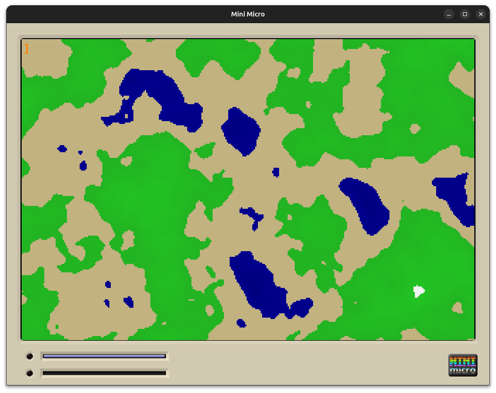

# PerlinNoise.ms

A deterministic 2D **Perlin noise** implementation for **MiniScript / Mini Micro**, based on Ken Perlin’s original permutation‑table algorithm.

This module is designed for procedural terrain, textures, clouds, water, and other smoothly varying signals commonly used in games and simulations.



---

## Background

Unlike pure random noise, Perlin noise produces **smooth, continuous variation**. Nearby points in space produce similar values, which makes it ideal for natural-looking patterns such as:

- terrain heightmaps  
- clouds and fog  
- water and lava flow  
- fire, smoke, and wind fields  
- procedural textures  

The algorithm works by defining a grid of gradients and smoothly interpolating between them using a carefully chosen fade curve.

---

## How This Implementation Works

This module implements **classic 2D Perlin noise** using:

- A fixed **permutation table** (the original Ken Perlin table)
- Gradient selection via hashing
- Smooth interpolation using the canonical *fade* function
- Deterministic output (same input → same output)

### Key Properties

- **2D only** (x, y)
- **Deterministic**
- **Continuous**
- Output range: **[0, 1]**
- No memory allocation during noise evaluation
- Suitable for real‑time use

---

## Installation

Copy `PerlinNoise.ms` into your project and import it:

```miniscript
import "PerlinNoise"
```

The module exposes a single type: `PerlinNoise`.

---

## Basic Usage

### Sampling Noise

```miniscript
n = PerlinNoise.noise(1.25, 3.75)
```

- Inputs are **continuous coordinates**, not integers.
- Output is a floating‑point value in the range **[0, 1]**.

⚠️ **Important:**  
Sampling at integer coordinates (e.g. `noise(10, 5)`) will always return `0.5`. This is expected behavior for Perlin noise and not a bug.

---

## Example: Simple Heightmap

```miniscript
scale = 64

for y in range(99)
    for x in range(99)
        h = PerlinNoise.noise(x / scale, y / scale)
        print h
    end for
end for
```

This produces smooth, spatially coherent values suitable for terrain or textures.

---

## Fractal / Octave Noise (Recommended)

Single‑octave Perlin noise shows grid artifacts. Realistic terrain uses **fractal noise**, which combines multiple octaves of Perlin noise at increasing frequencies and decreasing amplitudes.

Example helper:

```miniscript
fractalNoise = function(x, y, scale, octaves, persistence)
    total = 0
    amp = 1
    freq = 1
    maxAmp = 0

    for i in range(octaves - 1)
        total += PerlinNoise.noise(
            x / scale * freq,
            y / scale * freq
        ) * amp
        maxAmp += amp
        amp *= persistence
        freq *= 2
    end for

    return total / maxAmp
end function
```

Usage:

```miniscript
h = fractalNoise(x, y, 64, 4, 0.5)
```

This is the standard approach used in terrain generators and world maps.

---

## Example: Terrain Rendering (Mini Micro)

```miniscript
gfx.scale = 3
w = floor(gfx.width / gfx.scale)
h = floor(gfx.height / gfx.scale)

scale = 64

for y in range(h - 1)
    for x in range(w - 1)
        n = PerlinNoise.noise(x / scale, y / scale)

        if n < 0.35 then
            clr = color.fromList([0, 0, 120])
        else if n < 0.5 then
            clr = color.fromList([194, 178, 128])
        else if n < 0.75 then
            clr = color.fromList([34, 170, 34])
        else
            c = floor(200 + n * 55)
            clr = color.fromList([c, c, c])
        end if

        gfx.setPixel x, y, clr
    end for
end for
```

This produces water, sand, grass, and mountains from noise alone.

---

## Animation & Scrolling

To animate Perlin noise, **offset the input coordinates over time**:

```miniscript
t = time / 2000
n = PerlinNoise.noise(
    x / scale + t,
    y / scale
)
```

This makes the terrain appear to scroll smoothly.

---

## Common Pitfalls

- ❌ Sampling only integers → constant output (`0.5`)
- ❌ Using a single octave → visible grid artifacts
- ❌ Expecting randomness → Perlin noise is deterministic
- ✅ Always sample in continuous space
- ✅ Use multiple octaves for realism

---

## Design Notes

- This module uses **4 gradient directions**, which is fast and sufficient for most 2D terrain.
- Visual artifacts are minimized by octave summing rather than algorithmic complexity.
- The implementation avoids unnecessary object creation and is suitable for real‑time use.

---

## License

This implementation is provided as‑is for educational and practical use.  
Ken Perlin’s algorithm itself is public and widely implemented.

---

## References

- Ken Perlin, *Improving Noise*, SIGGRAPH 2002
